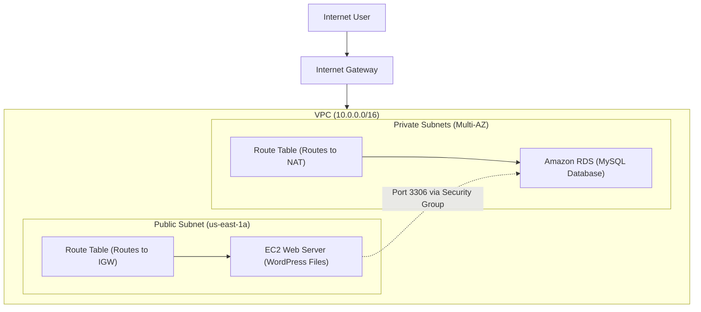

# End-to-End Multi-Tier WordPress Deployment on AWS with Terraform

Automating the deployment of a secure, scalable, and production-ready WordPress application using Infrastructure as Code.


---

##  Overview

This project solves the challenge of manually deploying and configuring multi-tier web applications, which is often slow, error-prone, and difficult to replicate. It provides a fully automated, production-grade Infrastructure as Code (IaC) solution using Terraform to provision a secure and scalable WordPress site on AWS.

The result is a robust, three-tier architecture that can be deployed, updated, or destroyed in minutes with just a few commands, ensuring consistency and reliability.

##  Architecture & Features

The infrastructure is designed with security and modularity as top priorities, following AWS best practices.

## Key Features

* **Secure Network Foundation:** Deploys a custom VPC with public subnets for web servers and private subnets for the database to prevent direct internet access to sensitive data.
* **Automated Provisioning:** An EC2 instance is automatically provisioned and configured using a `user_data` shell script, which installs Apache, a modern PHP version, and WordPress without any manual intervention.
* **Managed & Resilient Database:** Provisions a multi-AZ Amazon RDS (MySQL) instance for high availability and simplified database management.
* **Modular & Reusable Code:** The Terraform configuration is broken down into clean, reusable modules for networking, compute, and database layers, making the code maintainable and scalable.
* **Granular Security:** Utilizes AWS Security Groups to act as stateful firewalls, ensuring the web server can only accept HTTP/SSH traffic and the database can only accept connections from the web server.
* **Secure Credential Management:** Manages sensitive information like database passwords using a `terraform.tfvars` file, which is explicitly excluded from version control via `.gitignore`.

##  Repository Structure

The project is organized into logical modules for clean separation of concerns.

```text
.
├── modules/
│   ├── compute/              # Handles EC2, Security Group, and WordPress installation
│   │   ├── install_wordpress.sh
│   │   ├── main.tf
│   │   ├── outputs.tf
│   │   └── variables.tf
│   ├── database/             # Handles RDS Instance, Subnet Group, and Security Group
│   │   ├── main.tf
│   │   ├── outputs.tf
│   │   └── variables.tf
│   └── network/              # Handles VPC, Subnets, Gateways, and Route Tables
│       ├── main.tf
│       ├── outputs.tf
│       └── variables.tf
├── main.tf                   # Root module: orchestrates the network, database, and compute modules
├── terraform.tfvars.example  # Example variables file (DO NOT COMMIT YOUR ACTUAL .tfvars)
├── .gitignore                # Ensures sensitive files are not committed
└── README.md                 # This file
```
##  Terraform AWS WordPress Project

This project deploys a secure, automated WordPress environment on AWS using Terraform.

---

###  Tech Stack

| Component | Description |
|------------|-------------|
| **Terraform** | Infrastructure as Code tool for building, changing, and versioning infrastructure. |
| **AWS (Amazon Web Services)** | Cloud provider for all resources. |
| **VPC** | Isolated cloud network. |
| **EC2** | Virtual servers for hosting WordPress. |
| **RDS** | Managed relational database service for MySQL. |
| **Security Groups** | Virtual firewalls controlling inbound and outbound traffic. |
| **Internet Gateway & NAT Gateway** | Manage network traffic between public and private subnets. |
| **Shell Scripting** | Automates EC2 configuration via `user_data`. |
| **Git & GitHub** | Version control and collaboration. |

---

##  Setup and Deployment Instructions

Follow these steps to deploy the infrastructure in your own AWS account.

### 1. Prerequisites
- An active **AWS Account**
- **Terraform** installed on your local machine
- **AWS CLI** installed and configured

---

### 2. Clone the Repository

```bash
git clone https://github.com/githubabhay2003/aws-wordpress-terraform-project.git
cd aws-wordpress-terraform-project
```
### 3. Configure AWS Credentials:
Ensure your AWS CLI is configured with credentials that have sufficient permissions to create the resources.

```bash
aws configure
```
### 4. Prepare Terraform Variables:
Create a file for your secret variables. This file is git-ignored and should never be committed.

```bash
# Rename the example file
mv terraform.tfvars.example terraform.tfvars
# Edit terraform.tfvars and provide your own secure values
# For example:
# db_password = "YourVerySecurePassword123!"
```
### 5. Generate an SSH Key Pair:
This key allows secure connection to the EC2 instance.
```bash
ssh-keygen -t rsa -b 2048 -f ~/.ssh/wordpress-key
Then, update terraform.tfvars with the path to the public key:

ssh_key_path = "~/.ssh/wordpress-key.pub"
```
###  6. Initialize and Deploy:
```bash

# Initialize Terraform and download the required providers
terraform init

# (Optional) Preview the changes Terraform will make
terraform plan

# Apply the configuration to deploy the infrastructure
terraform apply -auto-approve
```
###  7. Verify Deployment:
After the apply is complete, Terraform will output the public URL of your WordPress site. Wait about 5 minutes for the installation script to complete, then navigate to the URL in your browser.

###  8. Cleanup:
Important: To avoid incurring costs, destroy all the resources when you are finished.

```bash

terraform destroy -auto-approve
```
##  Usage Example
Once deployed, the wordpress_url output will direct you to the WordPress installation page.

(Note: You can replace this with your own screenshot after a successful deployment)

##  Contributing
Contributions, issues, and feature requests are welcome! Feel free to check the issues page.

##  License
This project is licensed under the MIT License. See the LICENSE file for details.

##  Author & Contact
Abhay Kumar Saini

GitHub: @githubabhay2003

LinkedIn: https://www.linkedin.com/in/abhay-kumar-saini-571891264/
